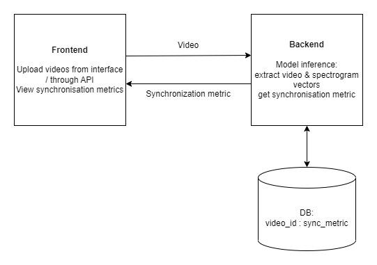

# CV_ITMO: Сихнронизация аудио- и видеодорожки в видео с говорящими людьми

### Подходы

- Векторизация кадров и аудио (в виде мел-спектрограмм) в одно пространство.
- Нахождение метрики сходства векторов, например cosine similarity.
- Loss - BCE, arcface, contrastive

Применима бинарная классификация (BCE), и метрика сходства н-р от 0 до 1 (arcface, contrastive)

### Данные

Фрагменты видеороликов с говорящими людьми.  
Одно лицо в кадре, 25FPS, 16kHz моно аудио.
Среднее разрешение лица во фрагменте > трешхолда N.

### Источники данных

AVSpeech
~2.7m train, ~130k test  
Датасет с говорящими на разных языках людьми, собран с ютуба.  
https://looking-to-listen.github.io/avspeech/download.html  

VoxCeleb2
~1.1m train, ~60k test  
Датасет с говорящими знаменитостями. Английский язык.  
https://paperswithcode.com/dataset/voxceleb2

VoxCeleb1
~110k train, ~7k test  
Датасет с говорящими знаменитостями.
Похож на VC2, только меньше, может быть хорошим дополнением. 
https://paperswithcode.com/dataset/voxceleb1

LRS1, LRS2 обракованы. Видео низкого качества

### Предобработка

Вход: видеозапись
- прогоняем через фекйс детектор
- получаем следующую информацию:
  - среднее / медианное разрешение лица 
  - на каких кадрах нет лица
  - на каких кадрах несколько лиц
  
- фильтруем по разрешению, выбрасываем без лиц и с несколькими лицами
- через syncnet python проверяем задержку между аудио и видео
- отбрасываем, где вне диапазона [-5, 5]
- внутри диапазона правим с помощью ffmpeg

Выход: кадры видео, аудиодорожка

### Сервис: назначение и бизнес метрика

Бизнес метрика - Synchronization Loss

Назначение - определение задержки (уровня синхронизации) между аудио- и видеодорожкой в видеозаписях с говорящими людьми.
### Сервис: схема

### Сервис: ограничения

25 FPS, один воркер с одной гпу - один запрос

### Сервис: масштабирование

Добавить очередь задач Celery. Масштабирование посредством увеличения числа воркеров.